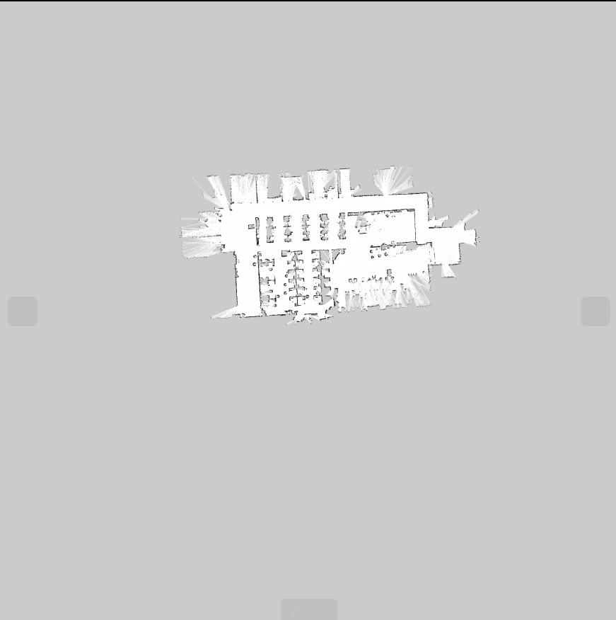

## sim-2d

# 1. 参考链接

1. stage                https://github.com/rtv/Stage 

2. stage_ros         https://github.com/ros-simulation/stage_ros

3. turtlebot_simulator   https://github.com/turtlebot/turtlebot_simulator/tree/melodic/turtlebot_stage

4. stage_api             http://rtv.github.io/Stage/modules.html

   

## 2. 注意事项

1. world中的pgm地图的外边界在stage加载的时候会去掉灰色的边缘，并裁剪地图的像素大小，导致实际像素与

   实际坐标值的转换的resolution出现变形；

解决方式： 地图裁剪，不留灰边的新地图拿去仿真验证



地图自己裁剪成下面的形式


nx800_0.world

```
include "turtlebot.inc"

define floorplan model
(
  # sombre, sensible, artistic
  color "gray30"

  # most maps will need a bounding box
  boundary 1

  gui_nose 1
  gui_grid 0
  gui_outline 0
  gripper_return 0
  fiducial_return 0
  laser_return 1
)

resolution 0.01  # 内部传感器反算ray-trace对应的分辨率
interval_sim 100  # simulation timestep in milliseconds

window
(
  size [ 800 800.0 ] # 显示窗口像素
  center [ 0.0 0.0 ]
  rotate [ 0.0 0.0 ]
  scale 60          # 1m对应显示窗口多少像素
)

floorplan
(
  name "map"
  bitmap "../nx800_0.pgm"
  size [ 44.85 24.6 0.02 ] # 对应gmapping建好的地图对应的实际尺寸， pixs*resolution
  pose [  0  0 0.0 0.0 ]
)

# throw in a robot
turtlebot
(
  pose [ -13.0 23.0 0.0 0.0 ]
  name "turtlebot"
  color "black"
)


```

turtlebot.inc

```
define kinect ranger
(
  sensor
  (
    #range_max 16
    range [ 0.0 16.0 ]
    fov 360.0
    samples 720
  )
  # generic model properties
  color "black"
  size [ 0.00 0.0 0.00 ]
)

define turtlebot position
(
  pose [ 0.0 0.0 0.0 0.0 ]

  odom_error [0.03 0.03 999999 999999 999999 0.02]

  size [ 0.27 0.22 0.01 ]
  origin [ 0.0 0.0 0.0 0.0 ]
  gui_nose 1
  drive "diff"
  color "gray"
  
  kinect(pose [ 0.0 0.0 0.0 0.0 ])
)

```

